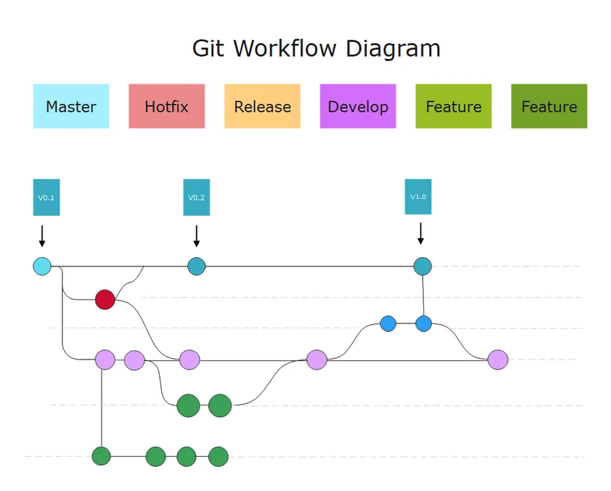
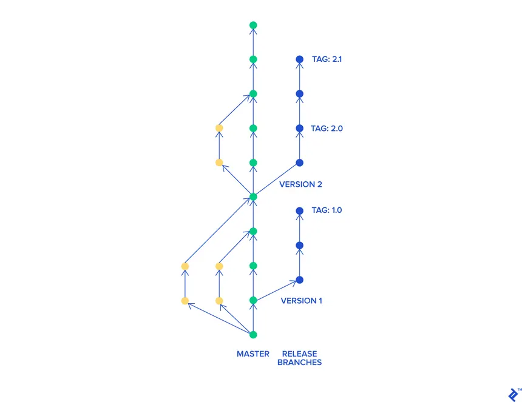

# Introduction au versioning avec GIT  <!-- omit in toc -->

## Sommaire <!-- omit in toc -->

- [Le versionning ?](#le-versionning-)
  - [VCS](#vcs)
- [Installation](#installation)
- [Repository](#repository)
- [Les commits](#les-commits)
  - [A quoi ça sert](#a-quoi-ça-sert)
  - [Quand en faire](#quand-en-faire)
  - [Qu'est-ce que ça contient](#quest-ce-que-ça-contient)
  - [Message de commit](#message-de-commit)
- [Les branches](#les-branches)
  - [A quoi servent les branches](#a-quoi-servent-les-branches)
  - [Quand faire des branches](#quand-faire-des-branches)
  - [Qu'est ce que ça contient](#quest-ce-que-ça-contient-1)
  - [Bien nommer les branches](#bien-nommer-les-branches)
- [Organiser son modèle de branches](#organiser-son-modèle-de-branches)
  - [Gitflow](#gitflow)
  - [Trunk-based](#trunk-based)
- [Fetch, pull et push](#fetch-pull-et-push)
  - [Fetch](#fetch)
  - [Push](#push)
  - [Pull](#pull)
- [Les issues](#les-issues)
- [Les flags et les releases](#les-flags-et-les-releases)
- [Automatiser pour de la CI/CD](#automatiser-pour-de-la-cicd)
- [Les outils](#les-outils)
  - [Intégrés (exemple avec vs code)](#intégrés-exemple-avec-vs-code)
  - [Externes](#externes)

## Le versionning ?

### VCS

- Version Control Systems
- outil permettant de suivre et gérer les changements de code sur une application
- permet à plusieurs développeur.ses de travailler sur le même projet en limitant les conflits
- historique :
  - 1970 : Source Code Control System, traçage basique des versions
  - début 1980 : Revision Control System, rajoute les branches et les merge
  - fin 1980 : Concurent Version System, développement concurrent
  - 2000 : Apache Subversion (SVN), améliore les performances de CVS
  - 2005 : après un conflit de license entre la fondation Linux et le versionning utilisé (BitKeeper), Linus Torvalds met au point Git

## Installation

- sur WSL / linux :

```bash
apt-get install git
```

- sur mac :

```bash
brew install git
```

## Repository

- espace de stockage permettant de sauvegarder le code de son application, l'historique de ses changements, les branches, ...
- repository distant (ou remote) : une version sauvegardée sur le cloud (de github, gitlab, bitbucket, ...)
- repository local : une version sauvegardée sur un ordinateur

**Créer un nouveau repository local :**

```bash
# Se mettre dans le dossier qui servira de repository

git init
```

**Lier un repository local avec un repository distant :**

```bash
#Après avoir créé un repository sur github, gitlab, bitbucket, ...

git remote add <name> <url>

# <name> : le tag que vous voulez donner à ce repository distant. On utilise `origin` en général
# <url> : l'url du repository distant que vous avez créé
```

## Les commits

### A quoi ça sert

- snapshot du code à un moment précis
- permet d'historiser les évolutions du code

**Quels sont les fichiers modifiés depuis le dernier commit :**

```bash
git status
```

**Ajouter des fichiers au prochain commit :**

```bash
git add <nom du fichier>

# Pour ajouter tous les fichiers modifiés :
git add .
```

**Créer un commit :**

```bash
git commit -m "<message>"
```

**Pour voir les commits récents :**

```bash
git log
```

### Quand en faire

- le plus souvent possible
  - pour pouvoir rollback avec précision en cas d'erreur
  - pour marquer l'étape du développement d'une fonctionnalité
  - pour mieux découper et organiser son travail

### Qu'est-ce que ça contient

- nom de l'auteur.ice du code
- timestamp
- message de commit
- code modifié :
  - ajout de nouveaux fichiers
  - suppression de fichiers
  - modification des contenus des fichiers

### Message de commit

- bien nommer permet :
  - de faciliter le travail à plusieurs
    - les autres comprennent plus facilement les évolutions du code
  - de faciliter la code review
    - comprendre l'objectif d'une évolution
  - améliorer l'historique
    - l'enchainement des commits permet de tracer les évolutions
  - automatiser
    - certains outils se basent sur les titres des commits pour
      - déployer une mise à jour
      - modifier la doc
      - envoyer des notifications (mail, slack, ...)
- utiliser une convention, comme <https://www.conventionalcommits.org/en/v1.0.0/>
  - `[type] scope : description`
    - `type` : feature, fix, test, documentation, ...
    - `scope` : numéro de ticket, fonctionnalité en train d'être développée, ...
    - `description`: court résumé de l'évolution

## Les branches

### A quoi servent les branches

- espaces de travails
  - séparés
  - parallèles
- permet de travailler sur une feature, résolution de bug, expérimentation, ... sans impacter les autres
- on fait une branche à partir d'une autre existante

**Créer une nouvelle branche :**

```bash
git checkout -b <name>
```

**Lister les branches du repository local :**

```bash
git branch
```

**Changer de branche :**

```bash
git checkout <name>
```

**Supprimer une branche locale :**

```bash
git branch -D <name>
```

### Quand faire des branches

- dès qu'un nouveau développement doit être fait
- selon l'organisation choisie, pour préparer un nouvel environnement (prod, test, recette, ...)
- selon l'organisation choisie, pour officialiser une nouvelle version de l'application (=release)

### Qu'est ce que ça contient

- tous les commits de la branche de base
- tous les commits qui sont faits sur cette nouvelle branche

### Bien nommer les branches

- comme les commits :
  - permet de comprendre quel est le rôle d'une branche
  - certains outils permettent d'automatiser des traitements selon le nom de la branche
    - déploiement, merge, fermeture de ticket, ...
- exemple :
  - `type/authorId_scope_description`
    - `type` : feature, test, fix, ...
    - `authorId` : moyen simple d'identifier qui a créé la branche
    - `scope` : numéro de ticket
    - `description` : quel est le rôle de la branche

## Organiser son modèle de branches

### Gitflow



- une branche dédiée par environnement
  - prod
  - dev
  - test
  - environnement client particulier
- une branche par feature qui part de la branche de prod
- une fois la feature terminée, merge vers dev
- une fois suffisamment de features terminées, merge vers test
- une fois les tests terminés et validés, merge vers la prod
- avantages :
  - facile à automatiser
  - permet de séparer les tâches et les autorisations selon l'environnement / la branche
- inconvénients :
  - focus sur le nouveau code ajouté, et pas sur la codebase entière
  - beaucoup de micro management et de process => lenteur
  - plusieurs branches avec des durées de vie longue => probabilité haute de créer des conflits

### Trunk-based



- une branche principale
- une branche par feature qui part de la branche principale
- une fois la feature terminée, merge vers la branche principale
- une fois suffisamment de features terminées et testées, création d'une branche release
  - cette branche ne sera plus jamais mise à jour
- avantages :
  - qu'une seule référence pour l'état du code (la branche principale)
  - des branches avec des durées de vie très courte => probabilité faible de conflits
  - tout le code est continuellement testé et relu, pas seulement les ajouts
  - rapide pour itérer
- inconvénients :
  - plus de liberté pour faire des modifications
  - plus possible d'avoir différentes fonctionnalités activées selon les branches / environnements
    - besoin d'implémenter des `feature flags`
  - besoin d'avoir des méthodes de test rigoureuses et complètes

## Fetch, pull et push

### Fetch

- pour aller vérifier sur le repository distant que de nouveaux commits ont été faits
  - que la branche distante est en avance sur la branche locale
- à faire impérativement avant de faire des pull ou des push
  - sinon, il est possible que `git pull` ne fonctionne pas
  - ou de créer une divergence de branches en faisant `git push`
    - vous partez du commit A, quelqu'un pousse un commit B, vous créez un commit B, vous ne pourrez ni récupérer le commit B distant ni envoyer votre commit B local

```bash
git fetch
```

### Push

- pour *pousser* les commits du repository local vers le repository distant
  - les commits de la branche active en cours

```bash
git push
```

### Pull

- pour *tirer* les commits du repository distant vers le repository local
  - les commits de la branche active en cours

```bash
git pull
```

## Les issues

## Les flags et les releases

## Automatiser pour de la CI/CD

github actions

## Les outils

### Intégrés (exemple avec vs code)

### Externes

Exemple avec gitkraken et github desktop
